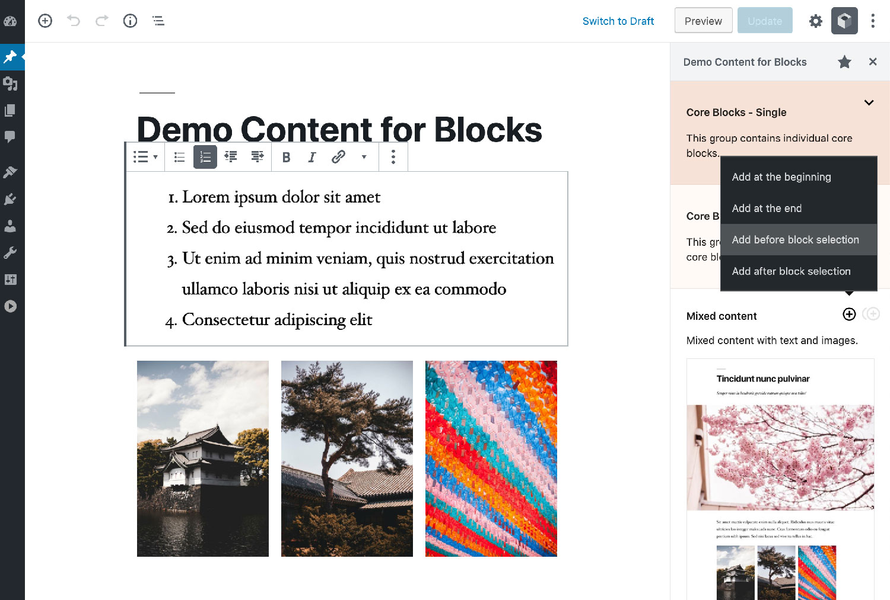

# Demo Content for Blocks

WordPress plugin that provides utilities to quickly add blocks with predefined content to any post.

If you are a developer the plugin can be used to set blocks with your own content. This way users will be able to add blocks with content already set. To check the documentation please refer to the [WordPress repository](https://wordpress.org/plugins/demo-content-for-blocks/) (until the documentation page is finished).

 

## Usage

Inside the Block editor, the Plugin can be opened from the Show More button (the 3 dots on the right side of the Editor Top Bar).

Click the More button and inside the menu list click on the plugin name **Demo Content for Blocks**.

---

This plugin can be downloaded from the [WordPress repository](https://wordpress.org/plugins/demo-content-for-blocks/).
