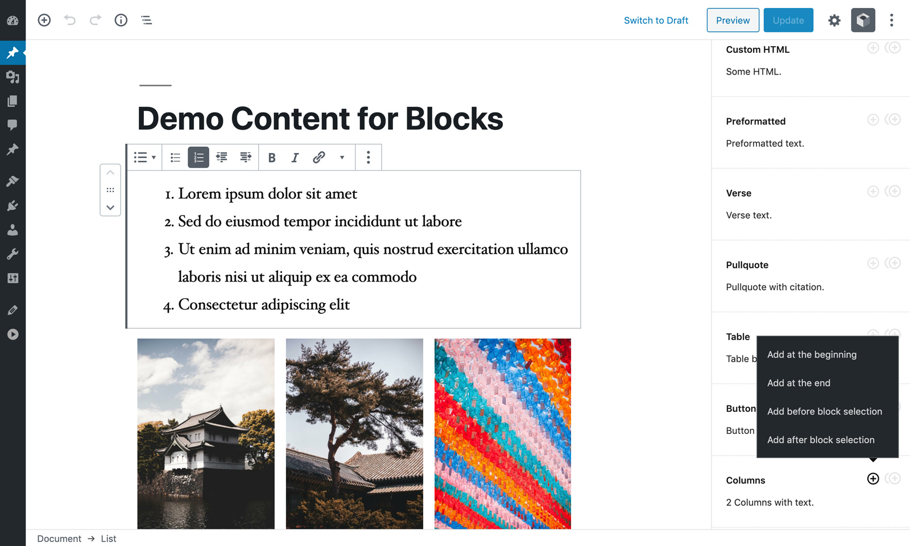

# Demo Content for Blocks

[Demo](https://gutenberg-showcase.melonpan.io/demo-content-for-blocks) - [Documentation](https://melonpan.io/wordpress-plugins/demo-content-for-blocks) - [WordPress](https://wordpress.org/plugins/demo-content-for-blocks)

 

Demo Content for Blocks provides utilities to quickly add blocks with predefined content to any post.

 

## Plugin and Theme developers

The plugin can be used to set blocks with your own content. This way users will be able to add blocks with content already set. For more information check the [documentation](https://melonpan.io/wordpress-plugins/demo-content-for-blocks).

 

## Screenshots

